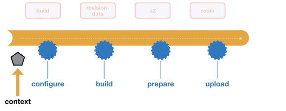
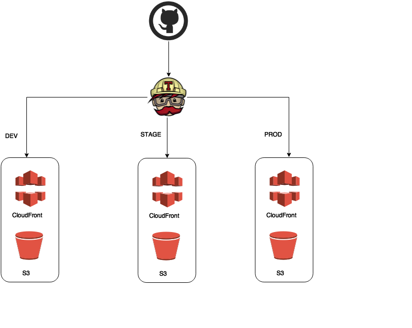

build-lists: true
autoscale: true

## Ember-cli deployment pipeline with travis-ci


 

 

---


Alexey (*Alex*) Kulakov


- SemiosBIO
- @akulakov
- aklkv.com

---
## Ember-cli deployment pipeline with travis-ci


 

 

---


- Pipeline Hooks
- Configuration
- Usage & Deployment Strategies
- Plugins and plugin packs

^
Ember CLI Deploy is an addon that provides a single interface for deploying Ember applications.
Just as any Ember app is served with ember serve and built with ember build, any app using Ember CLI Deploy is deployed with the same command: ember deploy.
To achieve this, Ember CLI Deploy structures your app’s deployment using a deploy pipeline, which consists of several pipeline hooks. These standard hooks are the foundation for a rich ecosystem of plugins which you can compose to create a deployment process suitable for your application.
Whether you need to compress or encode assets, upload your files to a private server or to AWS, or notify a Slack channel after a successful deploy, Ember CLI Deploy is up to the task. Keep reading to learn more.


---
### Pipeline Hooks

`ember deploy`

- configure
- setup
- willDeploy
- willBuild, build, didBuild,
- willPrepare, prepare, didPrepare,
- fetchInitialRevisions,
- willUpload, upload, didUpload,
- willActivate, activate, fetchRevisions, didActivate
- fetchRevisions
- teardown

---

`ember deploy:activate`

- configure
- setup
- fetchInitialRevisions
- willActivate
- activate
- fetchRevisions
- didActivate
- teardown

---

`ember deploy:list`

- configure
- setup
- fetchRevisions
- displayRevisions
- teardown

`didFail`

---
### Context Example



---

### Configuration

```javascript
  // deploy.js (sync)
  module.exports = function(environment){
    var ENV = {
    };

    if (environment === 'production') {
      ENV.redis = {
        url: process.env.REDIS_URL
      }
    };
    return ENV;
  };
```

---

### Additional Environments

```javascript
  // config/environment.js
  module.exports = function(environment){
  var ENV = {
  };

  if (environment === 'qa') {
    ENV.build.environment = 'development';
  };
  if (environment === 'staging') {
    ENV.build.environment = 'production';
  };
  return ENV;
  };
```

^
If you need to have the original environment that was passed into the ember build command, this can be obtained under the environment variable of `DEPLOY_TARGET` and referenced in any node.js context with `process.env.DEPLOY_TARGET`.

---

### dotEnv Support

^
It is often common to store sensitive data in environment variables and access them via `process.env` in the likes of `config/deploy.js`.

```bash
  # /.env

  AWS_KEY=123456
  AWS_SECRET=abcdef
```

---

```javascript
  // config/deploy.js
  module.exports = function(deployTarget) {
  var ENV = {
    s3: {
      accessKeyId: process.env.AWS_KEY,
      secretAccessKey: process.env.AWS_SECRET
    }
  };

  return ENV;
  };
```

---

###Deploy-Target Specific Variables

`ember deploy staging`

``` bash
  # /.env.deploy.staging

  AWS_KEY=78910
  AWS_SECRET=ghijkl
```

---

```javascript

  // config/deploy.js
  module.exports = function(deployTarget) {
    var ENV = { };

    if (deployTarget === 'staging') {
      ENV.s3 = {
        accessKeyId: process.env.AWS_KEY,
        secretAccessKey: process.env.AWS_SECRET
      };
    }

    return ENV;
  };
```
^
.gitignore
Remember to add all `.env` and `.env.deploy.<deploy-target>` files to your `.gitignore` file so you don’t accidentally expose sensitive information.


---

### Usage & Deployment Strategies

- `ember deploy`

^
runs main pipeline

- `ember deploy production`

^
production pipeline

- `ember deploy:activate production --revision=43cc587`

^
`--revision` key is mandatory

- `ember deploy:list`
- `ember deploy:list production`

---

### Example time


^
- `ember new <app-name>`
- `ember install ember-cli-deploy`
- `ember install ember-cli-deploy-aws-pack`

---

### Let's make it even more awesome

#### Ember-cli + AWS S3 (CloudFront) via travis-ci


---


- travis-ci.com
  - private
- travis-ci.org
  - public
  - free

---

```bash
    # .travis.yml
    script:
    - if [ "$TRAVIS_BRANCH" == "dev" ]; then ember deploy development --verbose; elif
      [ "$TRAVIS_BRANCH" == "stage" ]; then ember deploy staging --verbose; elif [ "$TRAVIS_BRANCH"
      == "master" ]; then ember deploy production --verbose; fi
```

---


# We are hiring

- akulakov@semios.com
- semios.com
